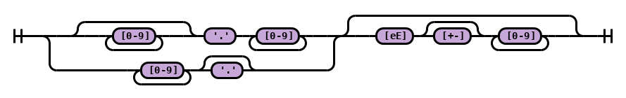

# Floating Point:

Floating point values are defined by the following syntax diagram:



Note that this is the exact same definition used in C, C++, and Java.

This corresponds to `decimalFloatingConstant` in the ANTLR grammar below.

```
grammar hrdf_floating_point;

decimalFloatingConstant

  : DecimalFloatingConstant EOF;

DecimalFloatingConstant

  : FractionalConstant ExponentPart?

  | DigitSequence ExponentPart?;

DigitSequence

  : [0-9]+;

WhiteSpace

  : [ \r\n\t] + -> skip;

fragment FractionalConstant

  : DigitSequence? '.' DigitSequence

  | DigitSequence '.';

fragment ExponentPart

  : 'e' ('+' | '-')? DigitSequence

  | 'E' ('+' | '-')? DigitSequence;
```

# Floating Point Expression

A formal ANTLR grammar for the floating point expressions is given below; note that this is dependent on the DecimalFloatingPoint type from above.

```
grammar hrdf_floating_point_expression;

expression

  : arithmeticExpression EOF;

primaryExpression

  : constant

  | '(' arithmeticExpression ')';

unaryOperator

  : '+' | '-';

unaryExpression

  : primaryExpression

  | unaryOperator unaryExpression;

multiplicativeExpression

  : unaryExpression

  | multiplicativeExpression '*' unaryExpression

  | multiplicativeExpression '/' unaryExpression;

additiveExpression

  : multiplicativeExpression

  | additiveExpression '+' multiplicativeExpression

  | additiveExpression '-' multiplicativeExpression;

arithmeticExpression

  : additiveExpression;

argumentExpressionList

  : arithmeticExpression (',' arithmeticExpression)*;

constant

  : decimalFloatingConstant

  | symbolicConstant;

decimalFloatingConstant

  : DecimalFloatingConstant;

symbolicConstant

  : 'pi';
```


# Rotation Expression

A formal ANTLR grammar for the rotation expression is given below; note that this is dependent on the arithmeticExpression type from above.

```
grammar hrdf_rotation;

expression

  : rotationExpression EOF;

rotationExpression

  : rotationTerm
  
  | rotationTerm '*' rotationExpression;

rotationTerm

  : rotationFunctionIdentifier '(' arithmeticExpression ')'

rotationFunctionIdentifier

  : 'Rx' | 'Ry' | 'Rz';

```
